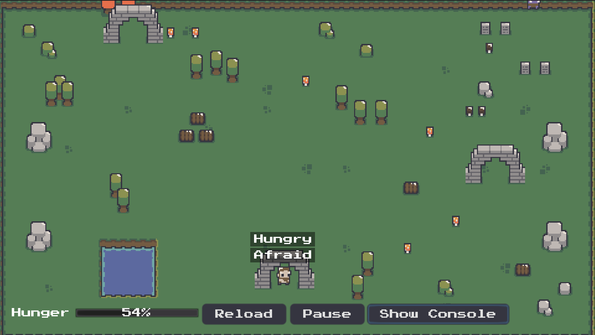

# Godot Goal Oriented Action Planning Example

## What the program should do

The main NPC (`./scenes/satyr.tscn`) needs to keep a firepit burning all the time.

This NPC has different goals with different (partially dynamical) priorities (higher numbers are higher priority).

There is another NPC (not using goap), the troll (`./scenes/troll.tscn`), which keeps wandering in the scene. If it gets
too close to the satyr, the satyr enters a frightned state.

## How it works

You should store all implemented actions in `./goap/actions/` and goals in `./goap/goals/`.

The `GoapAgent`(`./goap/agent.gd`) class integrates the NPC with the planner. It is responsible by requesting
plans and making sure the highest priority goal is being handled.

The `GoapActionPlanner`(`./goap/action_planner.gd`) is the heart of this implementation. When a plan is requested it first
creates a graph with all valid paths. Then it walks the graph building plans (list of actions) while summing their costs.
Finally, it returns the cheapest plan, which is executed by the agent.

Each action's logic should be placed inside the action script. All actions have a `perform` method which receives
an `actor` and a `delta`.

Check the scripts for comments with contextual information.
